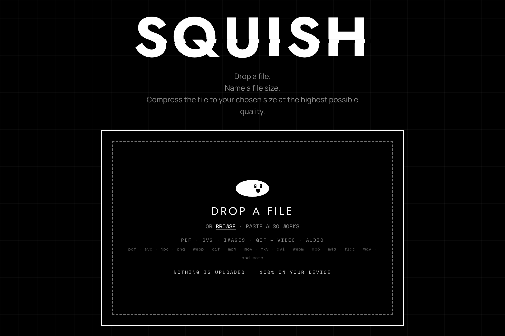
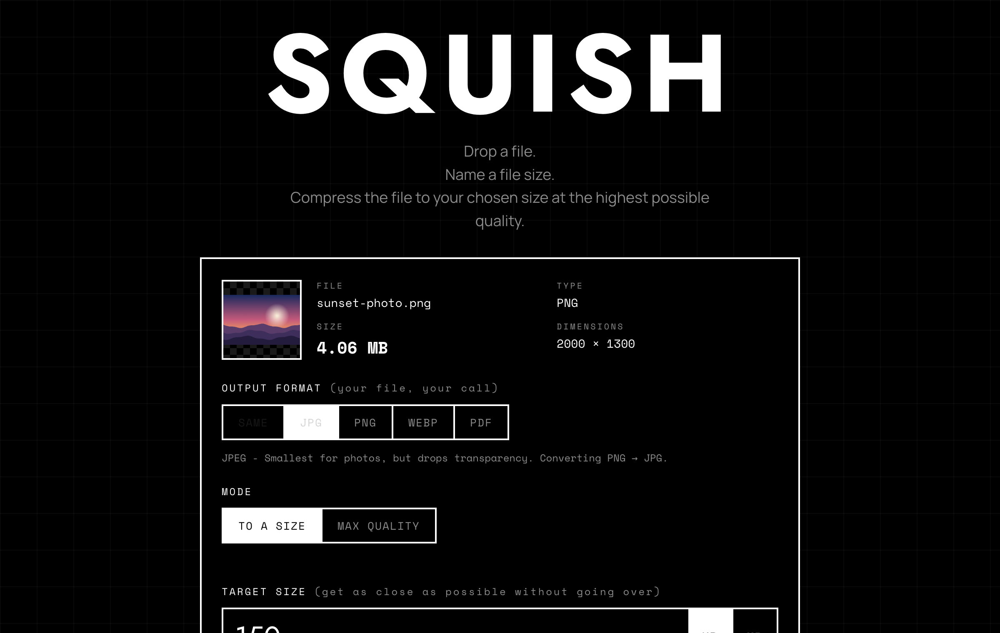

<div align="center">

# SQUISH

**Compress or convert any common file to an *exact* target size, at the best quality that fits under it. 100% in your browser. Nothing is uploaded.**

[](LICENSE)
[](manifest.webmanifest)
[-111111.svg)](#quick-start)
[](#privacy--security)
[](#privacy--security)

[**Live demo**](https://cubedivisiondev.github.io/squish/) · [Report a bug](https://github.com/cubedivisiondev/squish/issues/new?template=bug_report.yml) · [Request a feature](https://github.com/cubedivisiondev/squish/issues/new?template=feature_request.yml)



</div>

---

## What it is

Every other compressor hands you a quality slider and makes you guess. SQUISH takes the number instead. Drop a file, name an exact target in KB or MB, and get back the highest-quality file that fits at or under it. There is also a MAX QUALITY mode that converts at the best fidelity with no size target at all.

It runs entirely on the device. There is no server and there is no upload. Files are read locally and processed with the Canvas API and WebAssembly in the browser. It installs as a PWA and works offline after the first load. There is no build step: it is static HTML, CSS, and JavaScript.

## Highlights

- **Exact-size targeting.** Name a size in KB or MB. The output is never larger than the number you asked for (see [the guarantee](#the-never-over-target-guarantee)).
- **One tool, every common file.** Images, GIF, video, audio, PDF, and SVG, with format conversion including GIF to and from video.
- **Fully client-side.** Nothing is uploaded. The app runs offline after the first load.
- **MAX QUALITY mode.** Skip the target and convert at the best fidelity.
- **Installable PWA.** Add it to the home screen or the dock. It runs offline after the first load.
- **Zero build, zero server.** Static HTML, CSS, and JavaScript. Clone it and open it.
- **Accessible.** Keyboard-operable, with screen-reader labels, a semantic progress bar with a live value, and live status announcements.

## Supported formats

| Family | Input | Output |
| --- | --- | --- |
| **Images** | JPG, PNG, WEBP, BMP | JPG, PNG, WEBP |
| **GIF** | GIF (incl. animated) | GIF, or convert to MP4 / MOV / MKV |
| **Video** | MP4, MOV, MKV, AVI, WEBM (and more) | MP4, MOV, MKV, or convert to GIF |
| **Audio** | MP3, M4A, WAV, FLAC (and more) | MP3, M4A |
| **PDF** | PDF | PDF, or convert to JPG / PNG / WEBP |
| **SVG** | SVG | SVG (minified), or rasterize to PNG / JPG / WEBP / PDF |

Audio and video intake is decoded through FFmpeg, so many container formats beyond the ones listed will load. Output is held to the widely compatible set on purpose.

Sizes use decimal units (1 KB = 1000 bytes), so the number matches what the operating system shows on disk.

## How it works

The size a file lands at is measured, never estimated. For each media type SQUISH runs the same loop: probe, model, predict, verify.

1. **Probe.** Encode the file at several real settings (quality levels, scales, or bitrates) and measure the resulting bytes.
2. **Model.** Fit the size-versus-setting curve from those measured points.
3. **Predict.** Interpolate the setting that lands just under the target.
4. **Verify.** Encode at the predicted setting, measure again, and tighten with a binary search until the fit is as close under the target as it can get.

Because every size is measured on real output, the result is honest. Images probe their quality and scale points in parallel. GIF and audio/video run sequentially, because their WebAssembly engines share one virtual filesystem.

### The never-over-target guarantee

A "to a size" output is never larger than the target. When a target sits below the format's floor (a tiny vector, a minimum-bitrate codec), SQUISH reports the smallest size it can actually reach rather than quietly overshooting, and offers a one-tap larger target. Every engine, image through SVG, honors this.

<div align="center">

<br />
<sub>Name a target size, pick an output format, and SQUISH returns the best-quality file that fits under it.</sub>
</div>

## Quick start

SQUISH is a static site with no build step. Serve the folder over HTTP, since a service worker and WebAssembly need an `http(s)://` origin rather than `file://`:

```bash
git clone https://github.com/cubedivisiondev/squish.git
cd squish

# any static server works (pick one):
python3 -m http.server 5173      # then open http://localhost:5173
# or
npx serve .                       # prints its own URL
```

Open the printed URL. There are no dependencies to install and no bundler to run.

## Architecture

A single static page (`index.html` + `styles.css` + `app.js`) with a service worker. Each media type has a dedicated engine. The heavy WebAssembly codecs lazy-load from a CDN only when a matching file is used.

| Concern | Implementation |
| --- | --- |
| Images / SVG | Canvas API re-encode (`canvas.toBlob`), quality + scale probed in parallel |
| GIF | [`gifsicle-wasm-browser`](https://github.com/renzhezhilu/gifsicle-wasm-browser) |
| Video / audio | [`ffmpeg.wasm`](https://github.com/ffmpegwasm/ffmpeg.wasm) (single-threaded core) |
| PDF | [`pdf.js`](https://github.com/mozilla/pdf.js) to render + [`pdf-lib`](https://github.com/Hopding/pdf-lib) to rebuild |
| Offline / install | Service worker precache (`sw.js`) + Web App Manifest |

```
squish/
├── index.html              # app shell + SEO content + structured data
├── styles.css              # brutalist black/white system, one file
├── app.js                  # all engines + UI (no framework, no build)
├── sw.js                   # offline precache, network-first shell
├── manifest.webmanifest    # PWA metadata
├── fonts/                  # OFL webfonts (+ their licenses)
├── icons/                  # PWA / favicon set
├── vendor/ffmpeg/          # ffmpeg.wasm JS API (MIT), vendored same-origin
└── og-card.png             # social preview
```

The single-threaded `@ffmpeg/core` avoids `SharedArrayBuffer`, so no COOP/COEP headers are required. SQUISH drops onto any static host (GitHub Pages, S3, a plain folder) with nothing to configure.

## Privacy & security

- **Nothing is uploaded.** There is no backend. Files never leave the device.
- **Local processing only.** Everything happens in the browser through Canvas and WebAssembly. After the first load the app runs fully offline.
- **No accounts, no tracking, no analytics** in this repository.

See [SECURITY.md](SECURITY.md) to report a vulnerability.

## Browser support

Modern evergreen browsers (Chrome, Edge, Firefox, Safari) on desktop and mobile. WebAssembly, the Canvas API, and service workers are required. Video and audio transcoding is the most demanding operation and runs best with a desktop-class CPU.

## Tech & credits

Built with vanilla HTML, CSS, and JavaScript. No framework, no build tooling. It stands on excellent open-source work:
[ffmpeg.wasm](https://github.com/ffmpegwasm/ffmpeg.wasm),
[pdf.js](https://github.com/mozilla/pdf.js),
[pdf-lib](https://github.com/Hopding/pdf-lib),
[gifsicle-wasm-browser](https://github.com/renzhezhilu/gifsicle-wasm-browser),
and the [Jost](https://github.com/indestructible-type/Jost),
[Manrope](https://github.com/sharanda/manrope), and
[Space Mono](https://github.com/googlefonts/spacemono) typefaces.

Full attribution and licenses: [THIRD_PARTY_NOTICES.md](THIRD_PARTY_NOTICES.md).

## Contributing

Contributions are welcome. Read [CONTRIBUTING.md](CONTRIBUTING.md) and the [Code of Conduct](CODE_OF_CONDUCT.md) first. Bug reports and feature requests use the [issue templates](https://github.com/cubedivisiondev/squish/issues/new/choose).

## License

[MIT](LICENSE) © 2026 PUDDY Inc.

The MIT license covers the source code. The **PUDDY** and **SQUISH** names, logos, and brand assets are trademarks of PUDDY Inc. and are not covered by the code license. If you fork SQUISH, swap in your own branding. See [NOTICE](NOTICE) for details.

<div align="center">

Made by [Puddy Studios](https://puddystudios.com)

</div>
